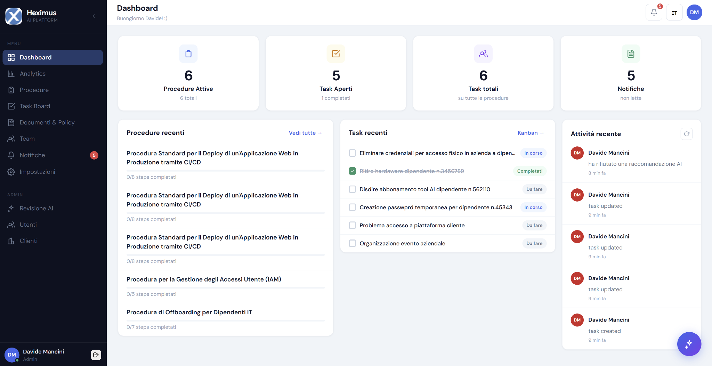

# Heximus — AI IT Platform

Piattaforma full-stack per la gestione di procedure IT, con generazione e revisione assistita da AI (Google Gemini). Progetto di tirocinio.



**Demo live:**

- Frontend: https://heximus-ai-platform.vercel.app
- Backend (API): https://ai-assisted-it-procedure-platform-kda9.onrender.com — nota: è su piano gratuito Render, la prima richiesta dopo un periodo di inattività potrebbe richiedere qualche secondo in più (cold start) asnche se sto utilizzando cron-job per cercare di mantenerlo sempre attivo

## Funzionalità principali

- **Heximus Board**: gestione procedure in stile Kanban (Da fare / In corso / In revisione / Fatto), con vista board, backlog e dashboard riassuntiva
- **Generazione AI**: creazione di procedure a partire da un prompt, con Google Gemini, revisione/accettazione da parte dello staff prima di diventare procedure reali
- **Revisione AI notturna**: uno scheduler interno rivede periodicamente le procedure esistenti e segnala problemi ad Admin/IT Manager
- **Task e collaborazione**: assegnazione task, priorità, stato, commenti, notifiche in tempo reale (Server-Sent Events) e push notification (Web Push/VAPID)
- **Gestione clienti**: portale clienti per upload documenti e risposta a richieste di dati, procedure/task collegati a un cliente specifico
- **Utenti e ruoli**: Admin, IT Manager, Engineer, Sales, Auditor, Customer, con workflow di approvazione per i nuovi account (registrazione → in attesa → assegnazione ruolo da parte di un Admin)
- **Audit log**: tracciamento immutabile delle azioni rilevanti
- **Multilingua**: interfaccia e contenuti in italiano, inglese e lituano

## Stack tecnologico

**Backend**

- FastAPI + SQLAlchemy, PostgreSQL
- Autenticazione JWT via cookie httpOnly
- Google Gemini (generazione/revisione/traduzione AI)
- Mailgun (email transazionali), Web Push (VAPID)
- APScheduler per i job pianificati
- pytest per i test

**Frontend**

- React 19 + Vite, Redux Toolkit
- React Router, react-i18next
- Bootstrap 5, Recharts

**Deploy** (piano gratuito)

- Frontend → Vercel
- Backend → Render (Web Service da Docker)
- Database → Neon (PostgreSQL serverless)

## Sviluppo locale

Richiede Docker e Docker Compose.

```bash
git clone <repo-url>
cd ai-it-platform
```

Crea `backend/.env` con le variabili elencate sotto, poi:

```bash
docker compose up --build
```

- Frontend: http://localhost:5173
- Backend: http://localhost:8000 (docs interattive su `/docs`)
- Postgres: esposto su `localhost:5433` per strumenti esterni (es. pgAdmin)

In alternativa, senza Docker: `npm install && npm run dev` in `frontend/`, e un virtualenv Python con `pip install -r requirements.txt` + `uvicorn main:app --reload` in `backend/` (richiede un Postgres raggiungibile).

## Variabili d'ambiente (`backend/.env`)

| Variabile                                                     | Descrizione                                                                                                           |
| ------------------------------------------------------------- | --------------------------------------------------------------------------------------------------------------------- |
| `DB_USERNAME`, `DB_PASSWORD`, `DB_NAME`                       | credenziali Postgres locale                                                                                           |
| `DB_HOST`, `DB_PORT`                                          | default `127.0.0.1:5433` in locale; `db:5432` dentro Docker Compose                                                   |
| `DATABASE_URL`                                                | se impostata, sovrascrive le variabili `DB_*` sopra con una connection string completa (usata in produzione per Neon) |
| `DB_SSL`                                                      | `true` per richiedere SSL (necessario per provider come Neon quando non si usa `DATABASE_URL`)                        |
| `JWT_SECRET`                                                  | chiave di firma dei token JWT                                                                                         |
| `COOKIE_SECURE`                                               | `true` solo dietro HTTPS reale; `false` in sviluppo locale/LAN                                                        |
| `FRONTEND_BASE_URL`                                           | origine del frontend, usata nei link delle email (es. reset password)                                                 |
| `PROD_FRONTEND_ORIGIN`                                        | origine del frontend di produzione, aggiunta alla whitelist CORS                                                      |
| `GEMINI_API_KEY`                                              | chiave API Google Gemini                                                                                              |
| `MAILGUN_API_KEY`, `MAILGUN_DOMAIN`                           | invio email transazionali                                                                                             |
| `VAPID_PUBLIC_KEY`, `VAPID_PRIVATE_KEY`, `VAPID_CLAIMS_EMAIL` | Web Push notifications                                                                                                |

Per il frontend, `frontend/.env` (o le env var della piattaforma di deploy):

| Variabile      | Descrizione                                                                                        |
| -------------- | -------------------------------------------------------------------------------------------------- |
| `VITE_API_URL` | URL base del backend; se assente, in sviluppo viene dedotto automaticamente dall'host della pagina |

## Test

```bash
cd backend
pip install -r requirements-dev.txt
pytest
```

## Struttura del progetto

```
backend/
  api/endpoints/     rotte FastAPI
  services/          logica di business
  repository/        accesso al database
  models/            modelli SQLAlchemy
  schemas/           modelli Pydantic (request/response)
  tests/             test pytest
frontend/
  src/components/    componenti React (procedai/ = pagine principali dell'app)
  src/redux/         store, actions e reducer Redux Toolkit
  src/hooks/         hook custom (notifiche SSE, Web Push)
  src/locales/        traduzioni it/en/lt
```
